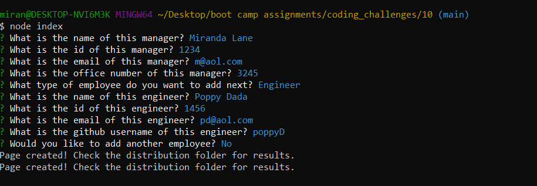
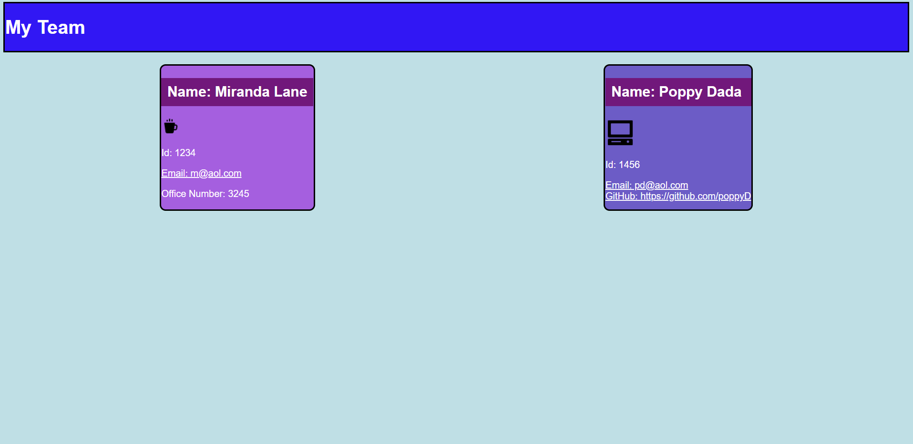

# Team Page Generator

# Description
The purpose of this project is to generate a styled html page based on the employee information given by the user.  It enabled me to practice capturing user input from inquirer, apply object oriented design principles with classes and ineritence, and write HTML and design HTML elements with CSS. 

# Built With
* Node.js
* Inquirer
* Jest
* HTML
* CSS

# Installation
* npm install

# Usage
* To run project: node index 
* To test project: npm run test

# Features
* The program starts by asking users for information about the manager.
* The user must add either an engineer or an intern after the manager.
* After the first two employees, the remaining employees are optional.
* Generated index.html and style.css files will appear in the distribution folder (./dist)
* A sample of output html and css files are in the sample folder. 

# ScreenShots/Links
* Github repo: https://github.com/MirandaL27/Team-Page-Generator
* Input:

* Output:

# Video Walkthroughs
[video demo of team html generator code](video-walkthrough.gif)

[video demo of testing process for html generator code](video-test-walkthrough.gif)

# Credits
* Miranda Lane